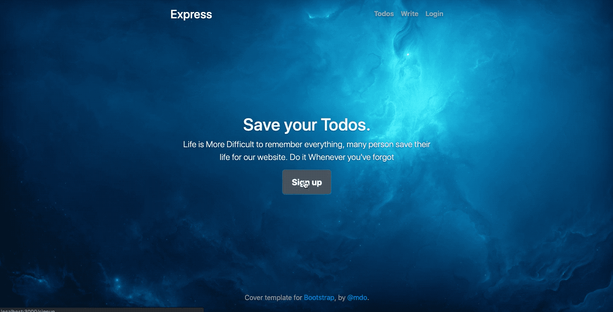
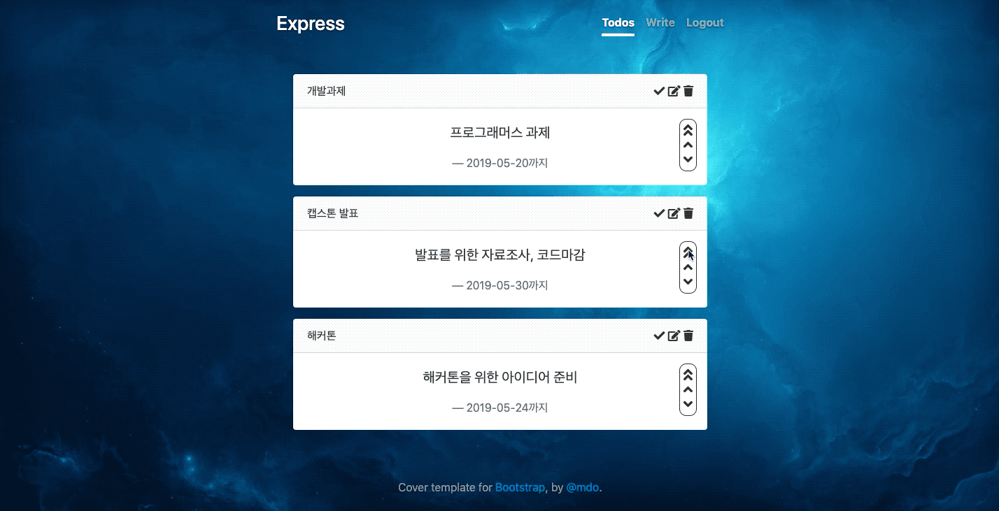

# TODO-Express

본 프로젝트는 간단한 TODO 웹으로서 다음과 같은 기능이 있습니다.

</img>

### 기능

-   새로운 TODO(제목과 내용)를 작성할 수 있다.
-   TODO 목록을 볼 수 있다.
-   TODO 항목의 제목과 내용을 수정할 수 있다.
-   TODO 항목을 삭제할 수 있다.
-   사용자의 선택에 의해 TODO에는 마감 기한을 넣을 수 있다.
-   TODO 항목의 우선순위를 설정 및 조절할 수 있다.
-   TODO 항목에 대한 완료 처리를 할 수 있다.
-   마감기한이 지난 TODO에 대해 알림을 노출할 수 있다.

### 실행 방법

1. mongo, redis, node, yarn을 설치한다.
2. `yarn`을 입력하여 모듈을 설치한다.
3. `yarn start`를 입력하여 코드를 실행한다.
4. `localhost:3000`에 들어가 확인한다.

### 기능소개

1. 회원기능
   </img>
2. 투두 쓰기 기능
   </img>
3. 투두 수정/기타 기능
   </img>
